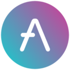

# Aave governance dashboard

<p align="center">


<p align="center"><code> Governance dashboard for Aave proposals</code></p>

`Aave governance dashboard` is an open source frontend interface for Aave governance, an a decentralised non-custodial liquidity protocol. This project is built by the community and maintained by @noraliucode.

## Contracts this UI interacts with

- [GovV2Helper](https://docs.aave.com/developers/protocol-governance/governance)

### Other services / libraries used

- [AragonUI](https://github.com/aragon/aragon-ui) - UI lib
- [The Graph](https://thegraph.com/)

## Install & Run

```shell
npm install && npm start
```
